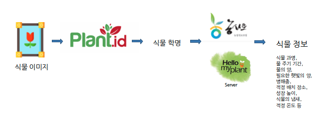
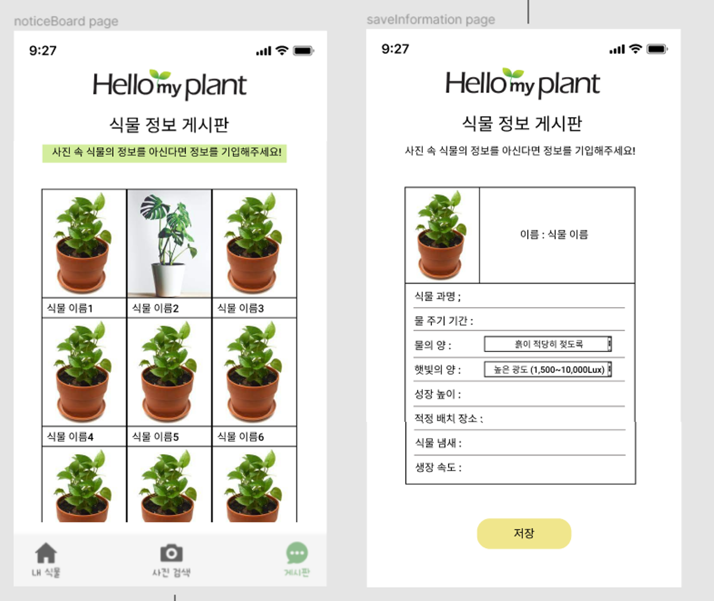
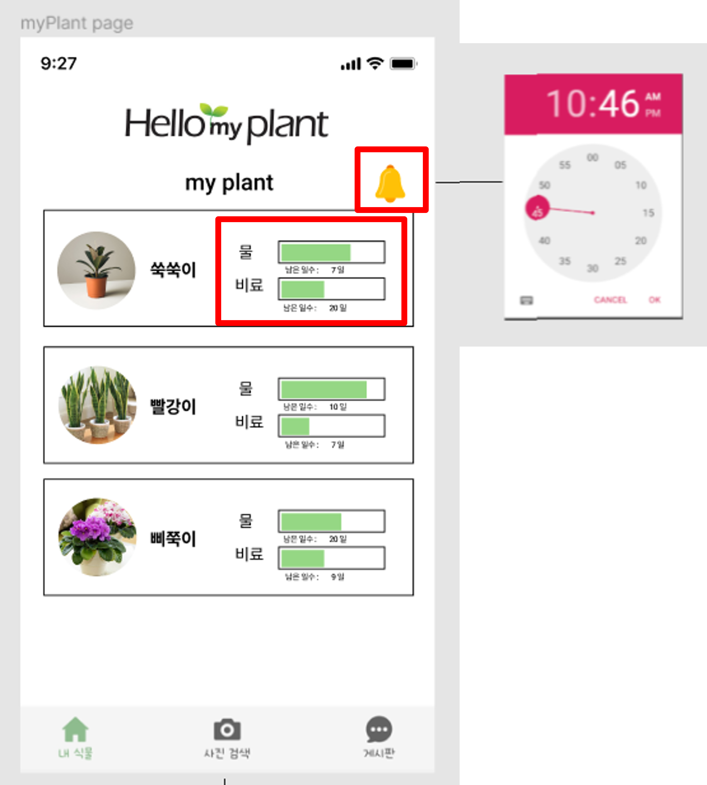
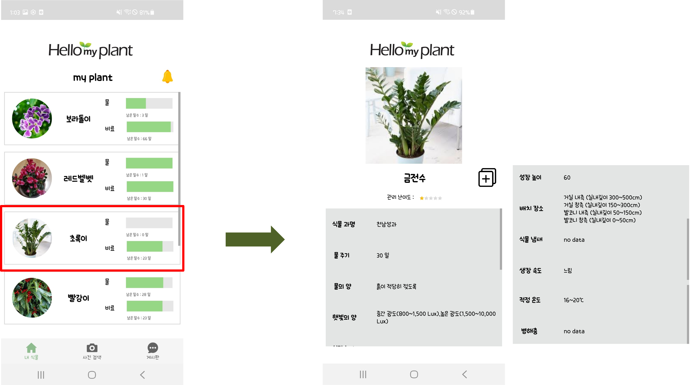

# 🌱 HelloPlant
**식물 식별 및 관리 앱**  
사진 한 장으로 식물을 식별하고, 나만의 식물 관리를 돕는 스마트 앱입니다.

## 📸 식물 식별 방법

 
 

### 🔍 **Plant.id API**
- 이미지 분석을 통해 식물의 학명, 정확도 등의 정보를 제공합니다.

### 🌿 **농사로 데이터베이스**
- 농촌진흥청의 "농사로" 데이터를 기반으로 실내 정원 식물 정보를 제공합니다.
- 데이터를 HelloPlant의 데이터베이스에 마이그레이션하여 사용합니다.

---

## 🌼 앱 기능

### 1️⃣ 식물 식별 기능
- 식물 사진을 찍으면 **즉시 식물 정보**를 확인할 수 있습니다.

  

 

- 만약 데이터베이스에 없는 식물이라면, **사용자 커뮤니티**가 함께 정보를 추가할 수 있습니다.
- 등록한 식물 정보가 업데이트되면 **이메일 알림**을 받습니다.

  

---

### 2️⃣ 식물 관리 기능
- 검색한 식물을 **내 식물 목록**에 추가하고, 나만의 방식으로 관리할 수 있습니다.

  

- **편집 기능**을 통해 내 식물의 이름, 정보 등을 자유롭게 수정할 수 있습니다.

  

- 주기적인 관리가 필요한 물주기와 비료주기 정보를 확인하고, **알람 기능**으로 잊지 않고 관리할 수 있습니다.

  

- 내 식물의 **자세한 정보**와 관리 팁을 한눈에 확인할 수 있습니다.

---

## 🤝 기여 방법
- 이 프로젝트에 기여하고 싶다면 `Pull Request`를 통해 제안해주세요.
- 버그 리포트 및 피드백은 `Issues`에서 언제든지 환영합니다.

---
